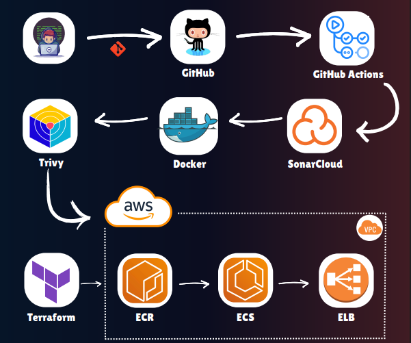

# Smart Delivery System

This project is a Parcel and Delivery Management System built using Angular for the frontend and a robust backend with Laravel, Spring Boot, Spring Cloud, and Flask. The backend and frontend folders are located in this global folder.

## Architecture & DevOps

## Setup Instructions

For detailed setup instructions for the frontend, please refer to the [Frontend README](https://github.com/Ayoub-Ajdour/Smart-delivery-system-frontend/blob/main/README.md).

For detailed setup instructions for the backend, please refer to the [Backend README](https://github.com/Ayoub-Ajdour/smart-delivery-system-backend/blob/main/readme.md).

